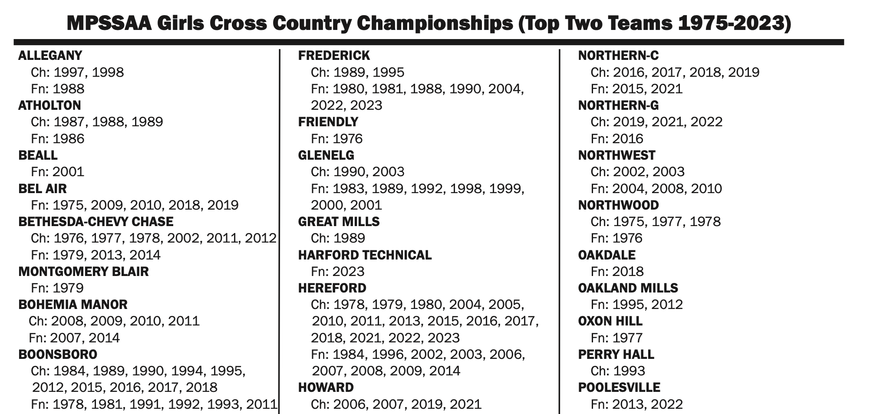
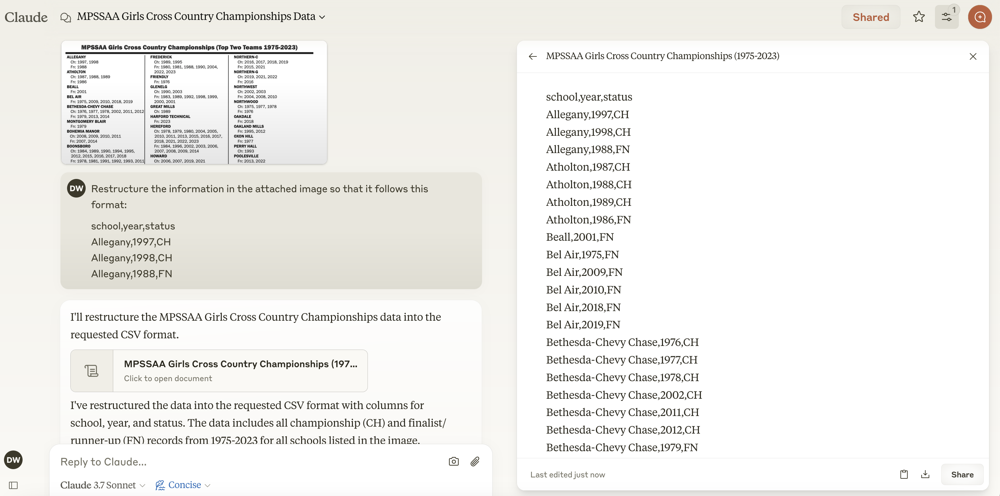
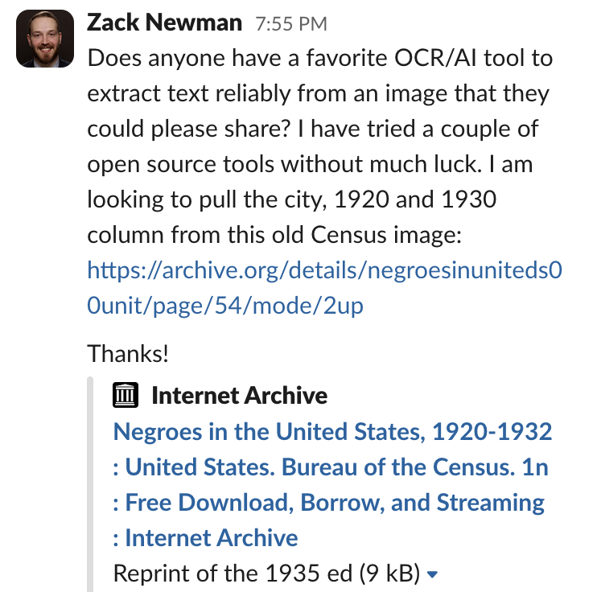
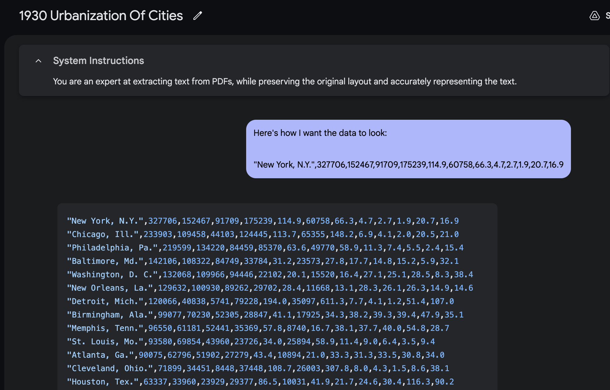
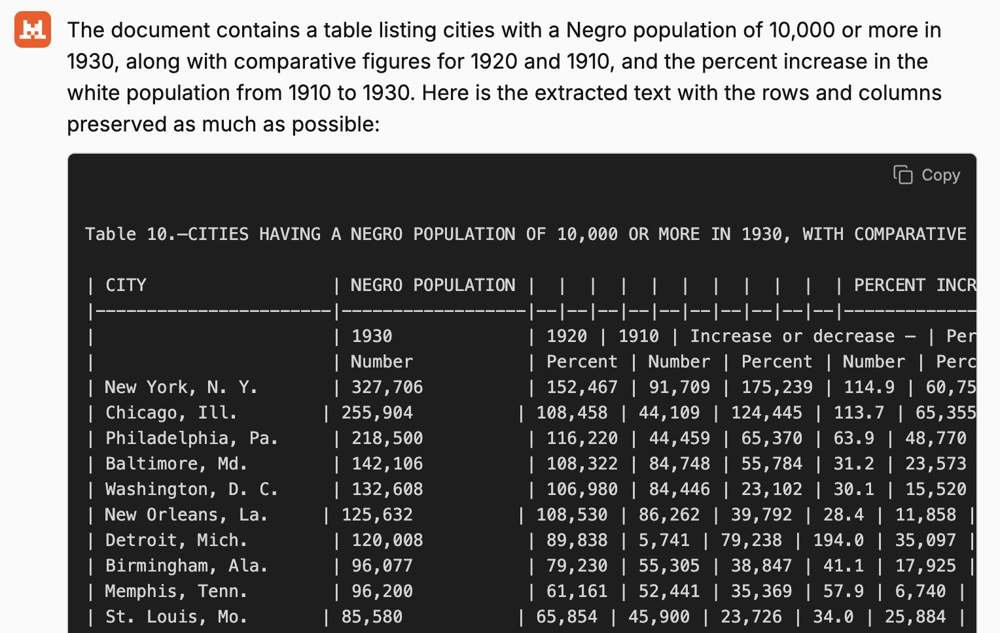

# The Worst PDFs on the Planet
## (Or, How I Gave Up on OCR Software and Embraced LLMs)
#### Derek Willis, University of Maryland
#### NICAR 25

## TL;DR

* Google Gemini Flash 2.0 is now my starting point for extracting text and tables from image PDFs.
* If you want another layer of OCR, AWS Textract is my go-to option
* If you don't want to give your PDFs to Google/Amazon, there are good (but sometimes complex) options!

## The Case for LLMs

Google Gemini has several advantages, but one of them is the absurdly large context window, which means you can upload 100+ page PDFs to it and get to work. It's also pretty cheap and if you want to go the programmatic route, you get 1,500 API calls a day for free. I've been using it for a few months now for PDF parsing and have yet to pay anything.

Other LLMs also do pretty well with image PDFs, and in fact make the case for dumping out the text or performing OCR weaker. They also require us to think about validation strategies.

## Scenario: Electronic PDF, But Multiple Columns

The Maryland Public Secondary School Athletic Association has record books for high school sports in the state. They are electronic PDFs, but they [suck](fall_2023.pdf).

In the past, I would have dumped out the text and then tried to reformat it using pattern matching or a text editor. Now I do this:

## Scenario: Election Results

God Bless Warren County, Pennsylvania, they put individual write-ins in their precinct report, turning it into a 132-page image PDF. I don't want the itemized write-ins, and I want to have some control over the process, so I'll go precinct-by-precinct.

After I establish that Gemini can do the basic stuff (extracting only what I want) right, then I go to formatting it the way I want.

Be deliberate: it's better to ask LLMs to do one thing at a time; in this case, I'm asking for one precinct at a time.

Check out [the result](warren.csv).

## Scenario: News Nerdery Challenge!

Recently, Zack Newman posted this question in the News Nerdery Slack: 

Again, I turned to Gemini, and because the original isn't a classic spreadsheet format, I needed to provide an example of how I wanted the output to look:

Let's check [the results](BlackPop1930.csv).

## Is This Correct?

LLMs are probablistic prediction machines. They get things wrong. How wrong? Yesterday, the French LLM Mistral launched what it called ["the world's best document understanding API"](https://mistral.ai/fr/news/mistral-ocr). I ran the News Nerdery Challenge PDF against it, because that's a tough one. [Here are the results](https://chat.mistral.ai/chat/7b144013-b8c0-4248-a7ce-0635ee822d3e).

The first row looks pretty good - the New York figures are correct except for one percentage - the raw numbers are accurate. Chicago? Only one of the first four numeric columns is correct, and in some cases the differences are large. Oh, look, New York appears again! And Mistral doesn't finish the document.

What you need is a validation plan. Some errors are easy to spot, but what if you have hundreds or thousands of records?

* Random sample spot-checking
* For numeric data, check against aggregate totals
* Repeat the process with the same LLM and compare the two results

## The Lessons

1. Do not speed-run this process. LLMs can quickly produce text, but don't work at that speed; impose a deliberate pace that you control.
2. Be specific in your prompts, and simple beats complex.
3. Your work isn't done when you have results. Have a validation strategy.
4. Consider all of your options; Gemini can be great, but you should try other tools.

## Other Tools

* [Docling](https://ds4sd.github.io/docling/)
* [olmOCR](https://olmocr.allenai.org/)
* [AWS Textract](https://aws.amazon.com/textract/)